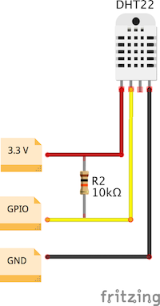

# DHT22 Prometheus exporter
[DHT22](https://www.sparkfun.com/datasheets/Sensors/Temperature/DHT22.pdf) temperature and humidity sensor Prometheus exporter
## Instalation
#### Connect the DHT22 to the raspberry Pi's GPIO port of your choice, 3.3v and GND


```
go get github.com/gnasr/dht22_exporter
cd $GOPATH/src/github.com/gnasr/dht22_exporter
GOOS=linux GOARCH=arm GOARM=5 go build -o dht22_exporter
```
## Usage
```
./dht22_exporter -gpio-port='4' -listen-address=':9543'
```

## License
GNU License, see [LICENSE](LICENSE.md)